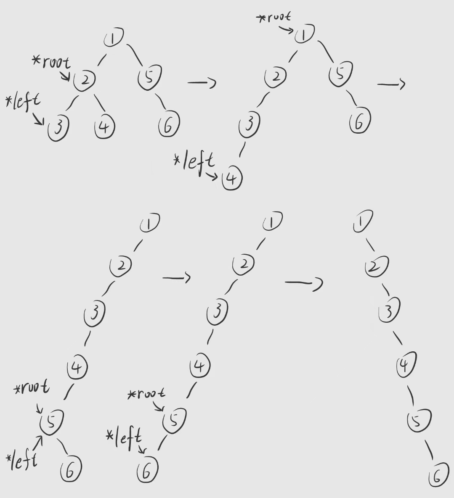
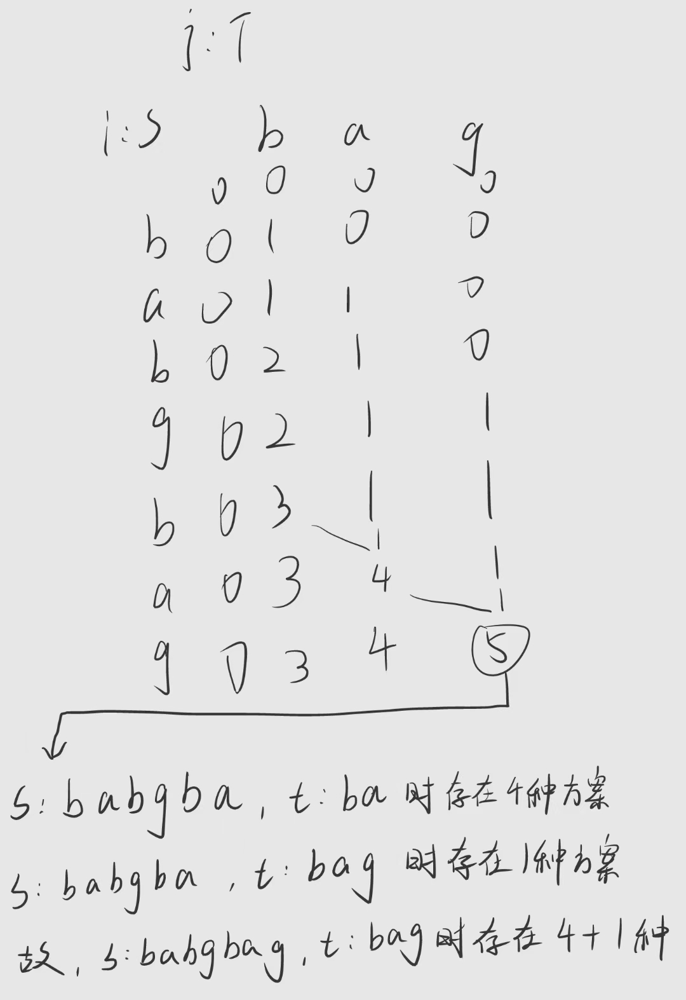
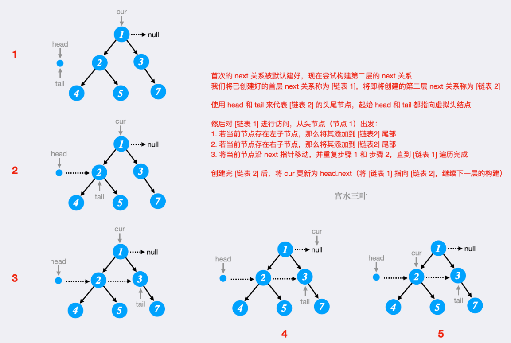
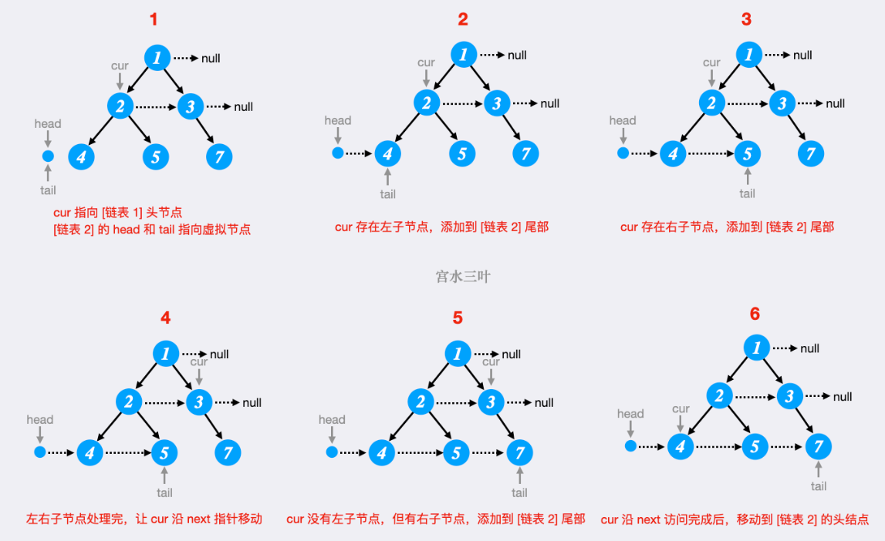
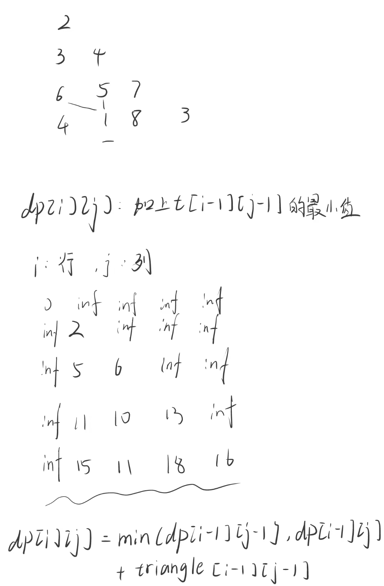

# 算法

## 注意

LeetCode 环境下，通常会对提交代码的运行环境进行封装，可能默认导入了一些常用的模块，比如 `math`。但本地环境中（如 PyCharm），这些模块需要你显式导入，否则会报 `NameError`。

## 动态规划

https://leetcode.cn/problems/scramble-string/solutions/51990/miao-dong-de-qu-jian-xing-dpsi-lu-by-sha-yu-la-jia/

**对于动态规划问题，将拆解为如下五步曲，这五步都搞清楚了，才能说把动态规划真的掌握了！**

1. 确定dp数组（dp table）以及下标的含义
2. 确定递推公式
3. dp数组如何初始化
4. 确定遍历顺序
5. 举例推导dp数组

## 递归

path用于存储路径

ans用于存储答案


## 50-100

### [85. 最大矩形](https://leetcode.cn/problems/maximal-rectangle/)

​    每一个‘高’对应一个列表，其中记录每一行连续1的个数作为‘宽’
​    取列表中最小的‘宽’与当前‘高’相乘作为‘面积’

```python
class Solution:
def maximalRectangle(self, matrix: List[List[str]]) -> int:
    n = len(matrix)
    m = len(matrix[0])
    ans = 0
    # 将每一个元素当做矩形右下角最后一个元素
    for i in range(n):
        for j in range(m):
            tmp_i = i
            tmp_j = j
            width = []  # 记录每一列对应的最长宽度
            height = 0
            # 逐列寻找连续的'1'
            while tmp_i >= 0 and matrix[tmp_i][tmp_j] == '1':
                tmp_width = 0
                height += 1
                # 逐行寻找连续的'1'
                while tmp_j >= 0 and matrix[tmp_i][tmp_j] == '1':
                    tmp_width += 1
                    tmp_j -= 1
                width.append(tmp_width)
                ans = max(ans, height * min(width))
                tmp_i -= 1
                tmp_j = j
    return ans

# 超时
```

结合84
    将每一个行结合该行上面的行组合成一个矩形
    计算出每一列的‘高度’，即连续的‘1’的‘高度’
    转换成84题


### [86. 分隔链表](https://leetcode.cn/problems/partition-list/)(链表创建代码)

```python
   	# 将输入的形如“[1,2,3,4,5]”的字符串转换成链表
    def create_ListNode(self):
        lst = list(input("list:")[1:-1].split(','))
        if lst == '[]':
            return ListNode()
        lst = [int(i) for i in lst]

        n = len(lst)

        # 头节点为空
        # head = ListNode()
        # tmp = ListNode(val=lst[0]
        # head.next = tmp

        # 头节点存数据
        head = tmp = ListNode(val=lst[0])
        for i in range(1, n):
            new = ListNode(val=lst[i])
            tmp.next = new
            tmp = tmp.next
        return head

```


### [87. 扰乱字符串](https://leetcode.cn/problems/scramble-string/)

#### 动态规划

https://leetcode.cn/problems/scramble-string/solutions/51990/miao-dong-de-qu-jian-xing-dpsi-lu-by-sha-yu-la-jia/

**对于动态规划问题，将拆解为如下五步曲，这五步都搞清楚了，才能说把动态规划真的掌握了！**

1. 确定dp数组（dp table）以及下标的含义
2. 确定递推公式
3. dp数组如何初始化
4. 确定遍历顺序
5. 举例推导dp数组

**实践**


​	1.确定下标意义

​		i：从s的第i个字符起

​		j：从t的第j个字符起

​		l：对比长度为l的字符串

​	2.推导递推公式


​	3.将dp初始化为 i\*i\*l ，值均为"False"的矩阵 （取s1:'abc'，s2:'cab')

```python
dp = [[[False]*(4) for _ in range(3)] for _ in range(3)]  # 这是3*3*4的矩阵 代码从左往右，矩阵从外向内生成
```


​	4.确定遍历顺序

​		l->i->j，没有按行列顺序进行

```python
        for l in range(2, lens1+1):
            for i in range(lens1-l+1):
                for j in range(lens1-l+1):
                    # 子片段
                    for temp in range(1, l):
```

​	5.举例推导dp数组

```python
                        if dp[i][j][temp] and dp[i+temp][j+temp][l-temp]:
                            dp[i][j][l] = True
                        if dp[i][j+l-temp][temp] and dp[i+temp][j][l-temp]:
                            dp[i][j][l] = True
```


```python
import numpy as np

class Solution:
    def isScramble(self, s1, s2):  # 判断s2是不是s1的扰乱字符串
        lens1 = len(s1)

        dp = [[[False]*(lens1+1) for _ in range(lens1)] for _ in range(lens1)]
        print(dp)
        print(np.array(dp).shape)
        # 先判断单个字母的是否匹配
        for i in range(lens1):
            for j in range(lens1):
                if s1[i] == s2[j]:
                    dp[i][j][1] = True

        for l in range(2, lens1+1):
            for i in range(lens1-l+1):
                for j in range(lens1-l+1):
                    # 子片段
                    for temp in range(1, l):
                        if dp[i][j][temp] and dp[i+temp][j+temp][l-temp]:
                            dp[i][j][l] = True
                        if dp[i][j+l-temp][temp] and dp[i+temp][j][l-temp]:
                            dp[i][j][l] = True

        return dp[0][0][lens1]


def main():
    # s1 = input("s1:")
    # s2 = input("s2:")
    s1 = "abcdefghijklmnopq"
    s2 = "efghijklmnopqcadb"
    ans = Solution().isScramble(s1, s2)
    print(ans)


if __name__ == '__main__':
    main()

```


#### 递归


```python
 	# 按位置逐位分割后进行子片段判断
    for i in range(1, lens1):
            if self.isScramble(s1[0: i], s2[0: i]) and self.isScramble(s1[i: lens1], s2[i: lens1]) \
                    or self.isScramble(s1[0: i], s2[lens1-i: lens1]) and self.isScramble(s1[i: lens1], s2[0: lens1-i]):
                return True
```


超时，进行剪枝

```python
        # 比较字符串构成的元素是否相同
        if sorted(s1) != sorted(s2):
            return False
```


```python
class Solution:
    def isScramble(self, s1, s2):  # 判断s2是不是s1的扰乱字符串
        lens1 = len(s1)
        lens2 = len(s2)
        if lens1 != lens2:
            return False
        # 比较字符串构成的元素是否相同
        if sorted(s1) != sorted(s2):
            return False
        if s1 == s2:
            return True

        # 按位置逐位分割后进行子片段判断
        for i in range(1, lens1):
            if self.isScramble(s1[0: i], s2[0: i]) and self.isScramble(s1[i: lens1], s2[i: lens1]) \
                    or self.isScramble(s1[0: i], s2[lens1-i: lens1]) and self.isScramble(s1[i: lens1], s2[0: lens1-i]):
                return True
        return False

def main():
    s1 = "abb"
    s2 = "bba"
    # s1 = "abcdefghijklmnopq"
    # s2 = "efghijklmnopqcadb"
    ans = Solution().isScramble(s1, s2)
    print(ans)


if __name__ == '__main__':
    main()
```


###  [89. 格雷编码](https://leetcode.cn/problems/gray-code/)

存在问题：无法正确跳出递归。从path去除的数字放入con后，会再次放入path的相同位置，导致死循环

```python
import math
from typing import List


class Solution:
    def grayCode(self, n: int) -> List[int]:
        ans = [0, ]
        con = [i for i in range(1, pow(2, n))]
        return self.dfs(ans, con, n)

    def dfs(self, path: list, con: list, n: int):
        if len(path) == pow(2, n):
            return path
        if len(path) == pow(2, n)-1:
            if (path[-1] ^ con[-1]) & ((path[-1] ^ con[-1]) - 1) == 0 and (path[0] ^ con[-1]) & ((path[0] ^ con[-1]) - 1) == 0:
                path.append(con[-1])
                return path
            else:
                con.append(path.pop())
                return

        for i in range(len(con)+1):
            if (path[-1] ^ con[i]) & ((path[-1] ^ con[i]) - 1) == 0:
                path.append(con[i])
                con.remove(con[i])
                self.dfs(path, con, n)
                if len(path) == pow(2, n):
                    return path
                temp = path.pop()
                con.insert(i, temp)


def main():
    n = 4
    print(Solution().grayCode(n))


if __name__ == '__main__':
    main()

```

#### 动态规划

https://leetcode.cn/problems/gray-code/solutions/9730/xiang-xi-tong-su-de-si-lu-fen-xi-duo-jie-fa-by--12/

按照动态规划或者说递归的思路去想，也就是解决了小问题，怎么解决大问题。

我们假设我们有了 n = 2 的解，然后考虑怎么得到 n = 3 的解。

n = 2 的解

```
00 - 0
10 - 2
11 - 3
01 - 1
```

如果再增加一位，无非是在最高位增加 0 或者 1，考虑先增加 0。由于加的是 0，其实数值并没有变化。

n = 3 的解，最高位是 0

```
000 - 0
010 - 2
011 - 3
001 - 1 
```


再考虑增加 1，在 n = 2 的解基础上在最高位把 1 丢过去？

```
100 - 4
110 - 6
111 - 7
101 - 5  
```

似乎没这么简单哈哈，第 4 行 001 和新增的第 5 行 100，有 3 个 bit 位不同了，当然不可以了。怎么解决呢？

很简单，第 5 行新增的数据最高位由之前的第 4 行的 0 变成了 1，所以其它位就不要变化了，直接把第 4 行的其它位拉过来，也就是 101。

接下来，为了使得第 6 行和第 5 行只有一位不同，由于第 5 行拉的第 4 行的低位，而第 4 行和第 3 行只有一位不同。所以第 6 行可以把第 3 行的低位拿过来。其他行同理，如下图。


```python
import math
from typing import List


class Solution:
    def grayCode(self, n: int) -> List[int]:
        ans = [0, 1]
        # 一轮一轮生成
        for i in range(1, n):
            temp = []  # 增加的新列表
            for j in range(1, len(ans)+1):
                temp.append(ans[-j]+pow(2, i))  # 总结出来的规律
            ans.extend(temp)
        return ans


def main():
    n = 4
    print(Solution().grayCode(n))


if __name__ == '__main__':
    main()

```

### [90. 子集 II](https://leetcode.cn/problems/subsets-ii/)

#### 超时

```python
# 超时
from typing import List
class Solution:
    def subsetsWithDup(self, nums: List[int]) -> List[List[int]]:
        path = [[], ]
        nums.sort()  # 排序，避免[1,2]和[2,1]都插入的情况
        self.dfs(path, nums)
        return path

    def dfs(self, path: list, nums: List[int]):
        if len(nums) == 0:
            return
        templst = []
        for i in range(len(nums)):
            templst.append(nums[i])
            if templst not in path:
                path.append(templst[:])  # 深拷贝
            tempval = nums[i]
            nums.remove(nums[i])
            self.dfs(path, nums)
            nums.insert(i, tempval)


def main():
    nums = [1, 4, 3, 5, 4, 4, 7, 7, 8, 0]
    print(Solution().subsetsWithDup(nums))


if __name__ == '__main__':
    main()

```

#### Accepted

**思路**

考虑数组 [1,2~1~,2~2~]，选择前两个数，或者第一、三个数，都会得到相同的子集。

也就是说，对于当前选择的数 2~2~，若前面有与2~2~相同的2~1~，且没有选择 2~1~，此时包含2~2~ 的子集，必然会出现在包含2~1~ 的所有子集中。

代码实现时，可以先将数组排序；迭代时，若发现没有选择上一个数，且当前数字与上一个数相同，则可以跳过当前生成的子集。


i：本轮次当前操作到第i个元素

j：操作i-len(nums)

j == i：开始操作nums[j]

j > i and nums[j] == nums[j-1]：当前元素与其前一个元素相同，且包含前一个元素的子集已经生成结束（前一个元素已经操作过了）

```python
from typing import List


class Solution:
    def subsetsWithDup(self, nums: List[int]) -> List[List[int]]:
        ans = []
        path = []
        nums.sort()  # 排序，使得相同元素相邻
        self.dfs(ans, path, nums, 0)
        return ans

    def dfs(self, ans: list, path: list, nums: List[int], i: int):
        ans.append(path[:])  # 深拷贝
        if i == len(nums):
            return
        for j in range(i, len(nums)):
            if j > i and nums[j] == nums[j-1]:
                continue
            path.append(nums[j])
            self.dfs(ans, path, nums, j+1)  # 本轮次已经操作到第j个元素，下一轮次从j+1开始操作
            path.pop()


def main() -> object:
    # nums = [1, 4, 3, 5, 4, 4, 7, 7, 8, 0]
    nums = [1, 2, 2]
    print(Solution().subsetsWithDup(nums))


if __name__ == '__main__':
    main()

```


### [93. 复原 IP 地址](https://leetcode.cn/problems/restore-ip-addresses/)

https://leetcode.cn/problems/restore-ip-addresses/solutions/100433/hui-su-suan-fa-hua-tu-fen-xi-jian-zhi-tiao-jian-by/

思路：

`path[]` 存储满足`0 <= tmp <= 255`的值

`len(path) `就是地址的段数

`index` 记录当前操作到什么位置了

当`len(path) == 4 and index == len(s)` 时，说明`path[]`中存的数字所组成的地址是合理的

`ans[]`存储满足要求的地址

```python
from typing import List


class Solution:
    def restoreIpAddresses(self, s: str) -> List[str]:
        ans = []
        path = []

        def dfs(__ans, __path, index: int):
            if len(path) > 4:
                return
            if len(__path) == 4 and index == len(s):
                __ans.append('.'.join(__path[:]))
                return
            # 检查随后的连续3个数字
            for i in range(1, 4):
                tmp = s[index: index+i]  # 切出需要进行判断的数字组合
                if tmp and 0 <= int(tmp) <= 255 and str(int(tmp)) == tmp:  # 判断当前数字组合能否当做一个段地址
                    path.append(tmp[:])
                    dfs(__ans, __path, index+i)  # 深入
                    path.pop()  # 恢复现场

        dfs(ans, path, 0)
        return ans


def main():
    # s = "25525511135"
    s = '0000'
    s = "101023"
    print(Solution().restoreIpAddresses(s))


if __name__ == '__main__':
    main()

```

`'.'.join(__path[:])`将列表转换成以`'.'`连接的字符串

```python
                if tmp and 0 <= int(tmp) <= 255 and str(int(tmp)) == tmp:  # 判断当前数字组合能否当做一个段地址
```

当下标越界时，`tmp == ''`

当`tmp == 012`这种类似的数字时，`str(int(tmp)) != tmp`


### [95. 不同的二叉搜索树 II](https://leetcode.cn/problems/unique-binary-search-trees-ii/)

```python
# Definition for a binary tree node.
from typing import List, Optional


class TreeNode:
    def __init__(self, val=0, left=None, right=None):
        self.val = val
        self.left = left
        self.right = right


# 题解
class Solution:
    def generateTrees(self, n: int) -> List[Optional[TreeNode]]:
        def dfs(l, r):
            if l > r:
                return [None]
            ans = []  # 从l到r的搜索树集合
            # 选子树的根节点
            for i in range(l, r + 1):
                # 选一棵左子树
                for x in dfs(l, i - 1):
                    # 选一棵右子树
                    for y in dfs(i + 1, r):
                        # 以当前元素为根节点
                        root = TreeNode(i)
                        # 拼接上左子树和右子树
                        root.left, root.right = x, y
                        ans.append(root)  # 只需要将树的头节点放入列表
            return ans

        return dfs(1, n)


def main():
    n = 5
    ans = Solution().generateTrees(n)
    print(len(ans))
    # for i in range(len(ans)):
    #     print('[', end='')
    #     for j in range(len(ans[i])):
    #         print(ans[i][j].val, end=',')
    #     print(']')
    # for i in range(len(ans)):
    #     print(ans[i].val)
    # print(ans[2].left.val)


if __name__ == '__main__':
    main()

```


### [96. 不同的二叉搜索树](https://leetcode.cn/problems/unique-binary-search-trees/)

可以直接用95题的思路，求出`ans[]`后返回`len(ans)`，但是提交时，超时了


卡特兰数是组合数学中一个常出现在各种计数问题中出现的数列。其公式为 :c(n)=c(2)*c(n-1)+c(3)*c(n-2)+...c(n-1)*c(2)。

假设n个节点存在

令G(n)的从1到n可以形成二叉排序树个数
令f(i)为以i为根的二叉搜索树的个数
即有:G(n) = f(1) + f(2) + f(3) + f(4) + ... + f(n)

n为根节点，当i为根节点时，其左子树节点个数为[1,2,3,...,i-1]，右子树节点个数为[i+1,i+2,...n]，所以当i为根节点时，其左子树节点个数为i-1个，右子树节点为n-i，即f(i) = G(i-1)*G(n-i),

上面两式可得:**G(n) = G(0)*G(n-1)+G(1)*(n-2)+...+G(n-1)*G(0)**

即n个节点构成的二叉搜索树共有G(n)种，其中
$$
G(n)=\sum_{i\ =\ 0}^{n-1}{G(i)G(n-i-1)}
$$

```python
class Solution:
    def numTrees(self, n: int) -> int:
        if n < 2:
            return 1
        dp = [1, 1] + [0] * (n - 1)
        for i in range(2, n+1):
            for j in range(i):
                dp[i] += dp[j] * dp[i - 1 - j]
        return dp[-1]


def main():
    n = 19
    print(Solution().numTrees(n))


if __name__ == '__main__':
    main()

```


### [98. 验证二叉搜索树](https://leetcode.cn/problems/validate-binary-search-tree/)

思路：

- 找出左子树中最大的值 `lmax`和右子树中最小的值`rmin`
- 确保`lmax < root.val <rmin`
- 递归判断每个节点都符合要求

```python
from typing import Optional


class TreeNode:
    def __init__(self, val=0, left=None, right=None):
        self.val = val
        self.left = left
        self.right = right


class Solution:
    def isValidBST(self, root: Optional[TreeNode]) -> bool:

        def find_min(r: Optional[TreeNode], _min: int) -> int:
            if r is None:  # 遇到空节点，返回当前最小值
                return _min
            # 比较当前节点的值与当前最小值
            if r.val < _min:
                _min = r.val
            # 递归查找左子树和右子树的最小值
            _min = find_min(r.left, _min)
            _min = find_min(r.right, _min)
            return _min

        def find_max(r: Optional[TreeNode], _max: float) -> float:
            if r is None:  # 遇到空节点，返回当前最大值
                return _max
            # 比较当前节点的值与当前最小值
            if r.val > _max:
                _max = r.val
            # 递归查找左子树和右子树的最小值
            _max = find_max(r.left, _max)
            _max = find_max(r.right, _max)
            return _max

        def dfs_lnr(r: Optional[TreeNode]):
            if r.left:
                if find_max(r.left, r.left.val) < r.val:
                    if not dfs_lnr(r.left):
                        return False
                else:
                    return False
            if r.right:
                if find_min(r.right, r.right.val) > r.val:
                    if not dfs_lnr(r.right):
                        return False
                else:
                    return False
            return True

        return dfs_lnr(root)


# 层序遍历构建二叉树
def build_tree_from_level_order(level_order):
    if not level_order:
        return None

    root = TreeNode(level_order[0])  # 创建根节点
    queue = [root]
    index = 1

    while index < len(level_order):
        node = queue.pop(0)  # 取出当前节点
        if level_order[index] is not None:  # 如果左子节点存在
            node.left = TreeNode(level_order[index])
            queue.append(node.left)
        index += 1

        if index < len(level_order) and level_order[index] is not None:  # 如果右子节点存在
            node.right = TreeNode(level_order[index])
            queue.append(node.right)
        index += 1

    return root


# 打印树的层序遍历，验证结果
from collections import deque


def print_tree(root):
    if not root:
        return
    queue = deque([root])
    while queue:
        node = queue.popleft()
        print(node.val, end=" ")
        if node.left:
            queue.append(node.left)
        if node.right:
            queue.append(node.right)


def main():
    # root = [5, 4, 6, None, None, 3, 7]
    # root = [26, 19, None, 27]
    root = [32, 26, 47, 19, None, None, 56, None, 27]
    root = build_tree_from_level_order(root)
    # print_tree(root)
    print(Solution().isValidBST(root))


if __name__ == '__main__':
    main()

```


**题解**

思路：

	- 划分一个上下界`[_min, _max]`
	- 各子树的取值范围要满足`_min < root.val < _max`
	- 对`root`的左子树进行判断时，要满足`_min < root.left.val < root.val`
	- 对`root`的右子树进行判断时，要满足`root.val < root.right.val < _max`
	- 递归修改`_min`和`_max`的值，来控制`root`的所有左子树的值均小于`root.val`，`root`的所有右子树的值均大于`root.val`

```python
from typing import Optional
import math


class TreeNode:
    def __init__(self, val=0, left=None, right=None):
        self.val = val
        self.left = left
        self.right = right


class Solution:
    def isValidBST(self, root: Optional[TreeNode], _min=-math.inf, _max=math.inf) -> bool:
        if not root:
            return True
        return _min < root.val < _max and self.isValidBST(root.left, _min, root.val) and self.isValidBST(root.right, root.val, _max)


# 层序遍历构建二叉树
def build_tree_from_level_order(level_order):
    if not level_order:
        return None

    root = TreeNode(level_order[0])  # 创建根节点
    queue = [root]
    index = 1

    while index < len(level_order):
        node = queue.pop(0)  # 取出当前节点
        if level_order[index] is not None:  # 如果左子节点存在
            node.left = TreeNode(level_order[index])
            queue.append(node.left)
        index += 1

        if index < len(level_order) and level_order[index] is not None:  # 如果右子节点存在
            node.right = TreeNode(level_order[index])
            queue.append(node.right)
        index += 1

    return root


# 打印树的层序遍历，验证结果
from collections import deque


def print_tree(root):
    if not root:
        return
    queue = deque([root])
    while queue:
        node = queue.popleft()
        print(node.val, end=" ")
        if node.left:
            queue.append(node.left)
        if node.right:
            queue.append(node.right)


def main():
    # root = [5, 4, 6, None, None, 3, 7]
    # root = [26, 19, None, 27]
    root = [32, 26, 47, 19, None, None, 56, None, 27]
    root = build_tree_from_level_order(root)
    # print_tree(root)
    print(Solution().isValidBST(root))


if __name__ == '__main__':
    main()

```


### [99. 恢复二叉搜索树](https://leetcode.cn/problems/recover-binary-search-tree/)

思路：

 - 记录最小值对应的节点`_min_node`和最大值对应的节点`_max_node`

 - 递归判断当前节点是否满足`_min_node.val < _root.val < _max_node.val`，如果不满足，则根据情况交互节点的值

 - 由于出现下列情况，虽然只是有两个节点的值错误，但是按本思路需要进行了两次值的交换

   

 - 每次交换完数值，都对整棵树进行判断，直到整棵树都满足二叉搜索树的要求


```python
# Definition for a binary tree node.
from typing import Optional
import math


class TreeNode:
    def __init__(self, val=0, left=None, right=None):
        self.val = val
        self.left = left
        self.right = right


class Solution:
    def recoverTree(self, root: Optional[TreeNode]) -> None:
        """
        Do not return anything, modify root in-place instead.
        """

        def dsf(_min_node: TreeNode, _max_node: TreeNode, _root: TreeNode):
            if not _root:
                return
            if _min_node.val < _root.val < _max_node.val:
                dsf(_min_node, _root, _root.left)  # 判断左子树
                dsf(_root, _max_node, _root.right)  # 判断右子树
            elif _min_node.val > _root.val:
                tmp = _min_node.val
                _min_node.val = _root.val
                _root.val = tmp
            elif _max_node.val < _root.val:
                tmp = _max_node.val
                _max_node.val = _root.val
                _root.val = tmp

        def judge(_min: int, _max: int, _root: TreeNode):
            if not _root:
                return TreeNode
            return _min < _root.val < _max and judge(_min, _root.val, _root.left) and judge(_root.val, _max, _root.right)

        min_node = TreeNode(-math.inf)
        max_node = TreeNode(math.inf)
        while not judge(min_node.val, max_node.val, root):
            dsf(min_node, max_node, root)


# 层序遍历构建二叉树
def build_tree_from_level_order(level_order):
    if not level_order:
        return None

    root = TreeNode(level_order[0])  # 创建根节点
    queue = [root]
    index = 1

    while index < len(level_order):
        node = queue.pop(0)  # 取出当前节点
        if level_order[index] is not None:  # 如果左子节点存在
            node.left = TreeNode(level_order[index])
            queue.append(node.left)
        index += 1

        if index < len(level_order) and level_order[index] is not None:  # 如果右子节点存在
            node.right = TreeNode(level_order[index])
            queue.append(node.right)
        index += 1

    return root


# 打印树的层序遍历，验证结果
from collections import deque


def print_tree(root):
    if not root:
        return
    queue = deque([root])
    while queue:
        node = queue.popleft()
        print(node.val, end=" ")
        if node.left:
            queue.append(node.left)
        if node.right:
            queue.append(node.right)


def main():
    # root = [1, 3, None, None, 2]
    root = [2, 3, 1]
    root = build_tree_from_level_order(root)
    print_tree(root)
    Solution().recoverTree(root)
    print()
    print_tree(root)


if __name__ == '__main__':
    main()

```

**题解**
思路：

 - 只需要记录当前节点的前驱结点`pre`即可
 - 中序遍历每个节点，并将其与其前驱节点进行比较
   - 当 当前节点的值比其前驱节点的值小时，该节点就是有问题的
   - 找出两个有问题的节点，将他们的值进行交换

```python
class Solution:
    def recoverTree(self, root: Optional[TreeNode]) -> None:
        """
        Do not return anything, modify root in-place instead.
        """
        # 中序遍历
        self.pre = None  # 记录前驱节点
        self.x = None  # 记录第一个有问题的节点
        self.y = None  # 记录第二个有问题的节点
        

        def dfs(node):
            if not node:
                return
            dfs(node.left)
            if self.pre and node.val < self.pre.val:
                if not self.x:  # 记录第一个点
                    self.x = self.pre
                self.y = node  # 记录第二个点，第二个点需要一直更新
            self.pre = node  # 更新前驱节点
            dfs(node.right)

        dfs(root)
        self.x.val, self.y.val = self.y.val, self.x.val  # 交换值
```


## 101-150

### [102. 二叉树的层序遍历](https://leetcode.cn/problems/binary-tree-level-order-traversal/)

思路：

 - 使用队列层序遍历树，列表`out`记录层序遍历到的每个节点值，列表`h`记录节点对应的高度
 - 将高度相同的点组合成一个列表
 - 将不同高度点组成的列表放入`ans`

```python
# Definition for a binary tree node.
from typing import List, Optional


class TreeNode:
    def __init__(self, val=0, left=None, right=None):
        self.val = val
        self.left = left
        self.right = right


class Solution:
    def levelOrder(self, root: Optional[TreeNode]) -> List[List[int]]:
        queue = []
        ans = []
        out = []
        h = []
        if root:
            queue.append(root)
            h.append(1)
        else:
            return ans
        i = 0
        while i < len(queue):
            node = queue[i]
            out.append(node.val)
            if node.left:
                queue.append(node.left)
                h.append(h[i] + 1)
            if node.right:
                queue.append(node.right)
                h.append(h[i] + 1)

            i += 1

        # print(h)
        tmp = []
        for i in range(len(out)):
            if not tmp:
                tmp.append(out[i])
            elif i > 0 and h[i] == h[i - 1]:
                tmp.append(out[i])
            else:
                ans.append(tmp[:])
                tmp = [out[i]]
        ans.append(tmp[:])

        return ans


# 层序遍历构建二叉树
def build_tree_from_level_order(level_order):
    if not level_order:
        return None

    root = TreeNode(level_order[0])  # 创建根节点
    queue = [root]
    index = 1

    while index < len(level_order):
        node = queue.pop(0)  # 取出当前节点
        if level_order[index] is not None:  # 如果左子节点存在
            node.left = TreeNode(level_order[index])
            queue.append(node.left)
        index += 1

        if index < len(level_order) and level_order[index] is not None:  # 如果右子节点存在
            node.right = TreeNode(level_order[index])
            queue.append(node.right)
        index += 1

    return root


# 打印树的层序遍历，验证结果
from collections import deque


def print_tree(root):
    if not root:
        return
    queue = deque([root])
    while queue:
        node = queue.popleft()
        print(node.val, end=" ")
        if node.left:
            queue.append(node.left)
        if node.right:
            queue.append(node.right)


def main():
    # root = [1, 3, None, None, 2]
    # root = [2, 3, 1]
    root = [3, 9, 20, None, None, 15, 7]
    root = build_tree_from_level_order(root)
    # print_tree(root)
    # Solution().recoverTree(root)
    print(Solution().levelOrder(root))
    # print_tree(root)


if __name__ == '__main__':
    main()

```


### [103. 二叉树的锯齿形层序遍历](https://leetcode.cn/problems/binary-tree-zigzag-level-order-traversal/)

思路：

- 在102基础上增加一个`flag`用于判断此时是从左忘记还是从右往左保存输出的节点
- 将列表`h`中值相等的元素按照`flag`的值进行顺序或逆序操作，在放入`ans`中

```python
# Definition for a binary tree node.
from typing import List, Optional


class TreeNode:
    def __init__(self, val=0, left=None, right=None):
        self.val = val
        self.left = left
        self.right = right


class Solution:
    def zigzagLevelOrder(self, root: Optional[TreeNode]) -> List[List[int]]:
        queue = []
        ans = []
        out = []
        h = []
        if root:
            queue.append(root)
            h.append(1)
        else:
            return ans
        i = 0
        while i < len(queue):
            node = queue[i]
            out.append(node.val)
            if node.left:
                queue.append(node.left)
                h.append(h[i] + 1)
            if node.right:
                queue.append(node.right)
                h.append(h[i] + 1)

            i += 1

        # print(h)
        tmp = []
        flag = 0
        for i in range(len(out)):
            if not tmp:
                tmp.append(out[i])
            elif i > 0 and h[i] == h[i - 1]:
                tmp.append(out[i])
            elif flag % 2 == 0:
                ans.append(tmp[:])
                flag += 1
                tmp = [out[i]]
            else:
                tmp.reverse()
                ans.append(tmp[:])
                flag += 1
                tmp = [out[i]]
        # 收尾
        if flag % 2 == 0:
            ans.append(tmp[:])
        else:
            tmp.reverse()
            ans.append(tmp[:])

        return ans


# 层序遍历构建二叉树
def build_tree_from_level_order(level_order):
    if not level_order:
        return None

    root = TreeNode(level_order[0])  # 创建根节点
    queue = [root]
    index = 1

    while index < len(level_order):
        node = queue.pop(0)  # 取出当前节点
        if level_order[index] is not None:  # 如果左子节点存在
            node.left = TreeNode(level_order[index])
            queue.append(node.left)
        index += 1

        if index < len(level_order) and level_order[index] is not None:  # 如果右子节点存在
            node.right = TreeNode(level_order[index])
            queue.append(node.right)
        index += 1

    return root


# 打印树的层序遍历，验证结果
from collections import deque


def print_tree(root):
    if not root:
        return
    queue = deque([root])
    while queue:
        node = queue.popleft()
        print(node.val, end=" ")
        if node.left:
            queue.append(node.left)
        if node.right:
            queue.append(node.right)


def main():
    # root = [1, 3, None, None, 2]
    # root = [2, 3, 1]
    # root = [3, 9, 20, None, None, 15, 7]
    root = [1, 2, 3]
    root = build_tree_from_level_order(root)
    # print_tree(root)
    # Solution().recoverTree(root)
    print(Solution().zigzagLevelOrder(root))
    # print_tree(root)


if __name__ == '__main__':
    main()

```


### [105. 从前序与中序遍历序列构造二叉树](https://leetcode.cn/problems/construct-binary-tree-from-preorder-and-inorder-traversal/)

思路：

- `preorder`中位置靠前的节点都是对应子树的根节点
- `inorder`中所有左子树的节点都在根节点的左边，右子树的节点都在根节点的右边
- 根据`preorder`中元素确定每个子树的根节点，在`inorder`中将根节点的左子树列表和右子树列表找出来
  - 在中序遍历的结果中找出根以及对应的左子树列表和右子树列表
  - 处理左子树
    - `_index = _left_list.index(preorder[i])  # preorder中位置靠前的一定是该子树的根`
    - `_root.left = TreeNode(preorder[i])  # 当前节点左子树的根`
    - `_left_list[: _index]  # 当前节点左子树的根对应的中序左子树列表`
    - ` _left_list[_index + 1:]  # 当前节点左子树的根对应的中序右子树列表 `
  - 处理右子树
    - `_index = _right_list.index(preorder[i])  # preorder中位置靠前的一定是该子树的根`
    - `_root.right = TreeNode(preorder[i])  # 当前节点右子树的根`
    - `_right_list[: _index]  # 当前节点右子树的根对应的中序左子树列表`
    - `_right_list[_index + 1:]  # 当前节点右子树的根对应的中序右子树列表`
- 注意：在`preorder`中连续的n个数可能都是某个节点的左子树，在处理完该左子树之后，要正确找到第一个未被处理的右子树节点

```python
from typing import Optional, List

# Definition for a binary tree node.
class TreeNode:
    def __init__(self, val=0, left=None, right=None):
        self.val = val
        self.left = left
        self.right = right


class Solution:
    def buildTree(self, preorder: List[int], inorder: List[int]) -> Optional[TreeNode]:
        # if len(preorder) == 0:
        #     return []
        root = TreeNode(preorder[0])

        def dfs(_left_list: List[int], _right_list: List[int], _root: TreeNode, i: int):
            # 处理左子树
            if len(_left_list) > 0:
                _index = _left_list.index(preorder[i])  # preorder中位置靠前的一定是该子树的根
                _root.left = TreeNode(preorder[i])
                dfs(_left_list[: _index], _left_list[_index + 1:], _root.left, i + 1)
            else:
                _root.left = None

            # 处理右子树
            if len(_right_list) > 0:
                # 找出 preorder 中第一个未被处理的右子树节点
                while preorder[i] not in _right_list:
                    i += 1
                _index = _right_list.index(preorder[i])  # preorder中位置靠前的一定是该子树的根
                _root.right = TreeNode(preorder[i])
                dfs(_right_list[: _index], _right_list[_index + 1:], _root.right, i + 1)
            else:
                _root.right = None

        index = inorder.index(preorder[0])
        # 对中序遍历结果进行进一步划分
        left_list = inorder[: index]
        right_list = inorder[index + 1:]
        dfs(left_list, right_list, root, 1)
        return root


# 打印树的层序遍历，验证结果
from collections import deque


def print_tree(root):
    if not root:
        return
    queue = deque([root])
    while queue:
        node = queue.popleft()
        print(node.val, end=" ")
        if node.left:
            queue.append(node.left)
        if node.right:
            queue.append(node.right)


def main():
    # preorder = [3, 9, 20, 15, 7]
    # inorder = [9, 3, 15, 20, 7]
    # preorder = [-1]
    # inorder = [-1]
    # preorder = [1, 2]
    # inorder = [1, 2]
    preorder = [3, 1, 2, 4]
    inorder = [1, 2, 3, 4]
    root = Solution().buildTree(preorder, inorder)
    print_tree(root)
    # Solution().recoverTree(root)
    # print_tree(root)


if __name__ == '__main__':
    main()

```


### [106. 从中序与后序遍历序列构造二叉树](https://leetcode.cn/problems/construct-binary-tree-from-inorder-and-postorder-traversal/)

思路：

- 参照105题

- `inorder`中所有左子树的节点都在根节点的左边，右子树的节点都在根节点的右边
- `postorder`中位置靠后的节点都是对应子树的根节点
- 根据`postorder`中元素确定每个子树的根节点，在`inorder`中将根节点的左子树列表和右子树列表找出来
- 注意：
  - 在`postorder`中连续的n个数可能都是某个节点的右子树，在处理完该右子树之后，要正确找到第一个未被处理的左子树节点
  - `postorder`中的输出是按照 左、右、根的顺序，所以要先处理根节点的右子树，再处理根节点的左子树

```python
from typing import Optional, List

# Definition for a binary tree node.
class TreeNode:
    def __init__(self, val=0, left=None, right=None):
        self.val = val
        self.left = left
        self.right = right


class Solution:
    def buildTree(self, inorder: List[int], postorder: List[int]) -> Optional[TreeNode]:
        def dfs(_left_list: List[int], _right_list: List[int], _root: TreeNode, i: int):
            # 先处理右子树
            if len(_right_list) > 0:
                _index = _right_list.index(postorder[i])
                _root.right = TreeNode(postorder[i])
                dfs(_right_list[: _index], _right_list[_index + 1:], _root.right, i - 1)
            else:
                _root.right = None
            # 再处理左子树
            if len(_left_list) > 0:
                while postorder[i] not in _left_list:
                    i -= 1
                _index = _left_list.index(postorder[i])
                _root.left = TreeNode(postorder[i])
                dfs(_left_list[: _index], _left_list[_index + 1:], _root.left, i - 1)
            else:
                _root.left = None

        root = TreeNode(postorder[-1])
        index = inorder.index(postorder[-1])
        left_list = inorder[: index]
        right_list = inorder[index + 1:]
        dfs(left_list, right_list, root, -2)
        return root


# 打印树的层序遍历，验证结果
from collections import deque


def print_tree(root):
    if not root:
        return
    queue = deque([root])
    while queue:
        node = queue.popleft()
        print(node.val, end=" ")
        if node.left:
            queue.append(node.left)
        if node.right:
            queue.append(node.right)


def main():
    inorder = [9, 3, 15, 20, 7]
    postorder = [9, 15, 7, 20, 3]
    root = Solution().buildTree(inorder, postorder)
    print_tree(root)
    # Solution().recoverTree(root)
    # print_tree(root)


if __name__ == '__main__':
    main()

```


### [107. 二叉树的层序遍历 II](https://leetcode.cn/problems/binary-tree-level-order-traversal-ii/)

思路：

- 采用102相同做法，在将每一层对应列表加入`ans`时，采用头插法即可


### [109. 有序链表转换二叉搜索树](https://leetcode.cn/problems/convert-sorted-list-to-binary-search-tree/)

思路：

- 采用递归的思路

- 将链表转换成存储`TreeNode`的列表`tree_list`
- 每次都选取列表中间的元素`tree_list[index]`作为节点
  - 将`tree_list[0: index]`作为左子树
  - 将`tree_list[index+1 :]`作为右子树

```python
# Definition for a binary tree node.
from typing import Optional, List


class TreeNode:
    def __init__(self, val=0, left=None, right=None):
        self.val = val
        self.left = left
        self.right = right


class Solution:
    def pathSum(self, root: Optional[TreeNode], targetSum: int) -> List[List[int]]:
        ans = []

        def dfs(_root: Optional[TreeNode], _path: list, _sum: int):
            if not _root:
                return
            elif _sum + _root.val == targetSum and not _root.left and not _root.right:
                _path.append(_root.val)
                ans.append(_path[:])
                _path.pop()  # 恢复现场
                return
            else:
                _path.append(_root.val)
                _sum += _root.val
                dfs(_root.left, _path, _sum)
                dfs(_root.right, _path, _sum)
                _path.pop()  # 恢复现场

        dfs(root, [], 0)
        return ans


# 层序遍历构建二叉树
def build_tree_from_level_order(level_order):
    if not level_order:
        return None

    root = TreeNode(level_order[0])  # 创建根节点
    queue = [root]
    index = 1

    while index < len(level_order):
        node = queue.pop(0)  # 取出当前节点
        if level_order[index] is not None:  # 如果左子节点存在
            node.left = TreeNode(level_order[index])
            queue.append(node.left)
        index += 1

        if index < len(level_order) and level_order[index] is not None:  # 如果右子节点存在
            node.right = TreeNode(level_order[index])
            queue.append(node.right)
        index += 1
    return root


def main():
    # root = [5, 4, 8, 11, None, 13, 4, 7, 2, None, None, 5, 1]
    # targetSum = 22
    # root = [1, 2, 3]
    # targetSum = 5
    root = [-2, None, -3]
    targetSum = -5
    root = build_tree_from_level_order(root)
    print(Solution().pathSum(root, targetSum))


if __name__ == '__main__':
    main()

```


### [113. 路径总和 II](https://leetcode.cn/problems/path-sum-ii/)

思路：

- 前序遍历
  - 判断加入当前节点的值以后是否满足路径和
  - 数值相等后，再判断当前节点是否为叶子结点
- 每一次对`_path`进行修改后，一定要在对应的位置**恢复现场**
- 由于路径和存在负数值，所以不能用`if not _root or _sum + _root.val > targetSum: return`进行剪枝

```python
# Definition for a binary tree node.
from typing import Optional, List


class TreeNode:
    def __init__(self, val=0, left=None, right=None):
        self.val = val
        self.left = left
        self.right = right


class Solution:
    def pathSum(self, root: Optional[TreeNode], targetSum: int) -> List[List[int]]:
        ans = []

        def dfs(_root: Optional[TreeNode], _path: list, _sum: int):
            if not _root:
                return
            elif _sum + _root.val == targetSum and not _root.left and not _root.right:
                _path.append(_root.val)
                ans.append(_path[:])
                _path.pop()
                return
            else:
                _path.append(_root.val)
                _sum += _root.val
                dfs(_root.left, _path, _sum)
                dfs(_root.right, _path, _sum)
                _path.pop()

        dfs(root, [], 0)
        return ans


# 层序遍历构建二叉树
def build_tree_from_level_order(level_order):
    if not level_order:
        return None

    root = TreeNode(level_order[0])  # 创建根节点
    queue = [root]
    index = 1

    while index < len(level_order):
        node = queue.pop(0)  # 取出当前节点
        if level_order[index] is not None:  # 如果左子节点存在
            node.left = TreeNode(level_order[index])
            queue.append(node.left)
        index += 1

        if index < len(level_order) and level_order[index] is not None:  # 如果右子节点存在
            node.right = TreeNode(level_order[index])
            queue.append(node.right)
        index += 1
    return root


def main():
    # root = [5, 4, 8, 11, None, 13, 4, 7, 2, None, None, 5, 1]
    # targetSum = 22
    # root = [1, 2, 3]
    # targetSum = 5
    root = [-2, None, -3]
    targetSum = -5
    root = build_tree_from_level_order(root)
    print(Solution().pathSum(root, targetSum))


if __name__ == '__main__':
    main()

```


### [114. 二叉树展开为链表](https://leetcode.cn/problems/flatten-binary-tree-to-linked-list/)

思路：

- 从上至下遍历节点
  - 找到最左下的节点`left`
  - 找到离`left`最近的存在右子节点的节点`root`，以及其右子节点`root.right`
  - 将`root.right`变成`left`的左子节点
  - 循环
- 将整棵树变成只有左子节点的树
- 将整棵树的左子结点全部变成右子节点

注意：由于要满足先序遍历的顺序，从上至下遍历节点的话，只能现将树变成只有左子结点的树




```python
# Definition for a binary tree node.
import copy
from typing import Optional


class TreeNode:
    def __init__(self, val=0, left=None, right=None):
        self.val = val
        self.left = left
        self.right = right


class Solution:
    def flatten(self, root: Optional[TreeNode]) -> None:
        """
        Do not return anything, modify root in-place instead.
        """

        def dfs(_root: TreeNode):
            if not _root:
                return
            # 从最左下开始，改变树的结构
            if _root.left:
                dfs(_root.left)
            if _root.right:
                _node = _root
                # 找到最左下的节点
                while _node:
                    _left = _node
                    _node = _node.left
                # 将当前节点的右子节点放到最左下节点的左子节点
                _left.left = _root.right
                _root.right = None
                dfs(_left)

        dfs(root)
        node = root
        while node:
            node.right = node.left
            node.left = None
            node = node.right


# 层序遍历构建二叉树
def build_tree_from_level_order(level_order):
    if not level_order:
        return None

    root = TreeNode(level_order[0])  # 创建根节点
    queue = [root]
    index = 1

    while index < len(level_order):
        node = queue.pop(0)  # 取出当前节点
        if level_order[index] is not None:  # 如果左子节点存在
            node.left = TreeNode(level_order[index])
            queue.append(node.left)
        index += 1

        if index < len(level_order) and level_order[index] is not None:  # 如果右子节点存在
            node.right = TreeNode(level_order[index])
            queue.append(node.right)
        index += 1

    return root


# 打印树的层序遍历，验证结果
from collections import deque


def print_tree(root):
    if not root:
        return
    queue = deque([root])
    while queue:
        node = queue.popleft()
        print(node.val, end=" ")
        if node.left:
            queue.append(node.left)
        if node.right:
            queue.append(node.right)


def main():
    root = [1, 2, 5, 3, 4, None, 6]
    root = build_tree_from_level_order(root)
    # print_tree(root)
    Solution().flatten(root)
    print_tree(root)
    # print_tree(root)


if __name__ == '__main__':
    main()

```


### [115. 不同的子序列](https://leetcode.cn/problems/distinct-subsequences/)

思路：

- 下标 i 对应子串 s 的索引 
- 下标 j 对应子串 t 的索引
- 递推公式为：
  - `if s[i - 1] == t[j - 1] and j == 1: dp[i][j] = dp[i - 1][j] + 1`
  - `if s[i - 1] == t[j - 1] and j != 1: dp[i][j] = dp[i - 1][j-1] + dp[i - 1][j]` 
  - `if s[i - 1] != t[j - 1]: dp[i][j] = dp[i - 1][j-1]`




```python
from typing import List


class Solution:
    def numDistinct(self, s: str, t: str) -> int:
        lens = len(s)
        lent = len(t)

        dp = [[0] * (lent + 1) for _ in range(lens + 1)]

        # 遍历 dp 数组
        for i in range(1, lens + 1):
            for j in range(1, lent + 1):
                if s[i - 1] == t[j - 1]:
                    if j == 1:
                        dp[i][j] = dp[i-1][j] + 1
                    else:
                        dp[i][j] = dp[i - 1][j - 1] + dp[i - 1][j]
                else:
                    dp[i][j] = dp[i - 1][j]

        return dp[-1][-1]


def main():
    s = "babgbag"
    t = "bag"
    # s = "rabbbit"
    # t = "rabbit"
    # s = "a"
    # t = "b"
    print(Solution().numDistinct(s, t))


if __name__ == '__main__':
    main()

```


### [116. 填充每个节点的下一个右侧节点指针](https://leetcode.cn/problems/populating-next-right-pointers-in-each-node/)

思路：

- 由于二叉树为完美二叉树，所以第`i`层有 $2^{(i - 1)}$ 个节点

- 层序遍历完美二叉树，结果保存到数组`queue`中
- 利用完美二叉树的性质，按照高度对`queue`分区

```python
# Definition for a Node.
from typing import Optional
import math


class Node:
    def __init__(self, val: int = 0, left: 'Node' = None, right: 'Node' = None, next: 'Node' = None):
        self.val = val
        self.left = left
        self.right = right
        self.next = next


class Solution:
    def connect(self, root: 'Optional[Node]') -> 'Optional[Node]':
        # 当 root == None时，len(queue) == 1，报错 AttributeError: 'NoneType' object has no attribute 'left'
        if not root:
            return None
        queue = [root]
        i = 0
        # 层序遍历
        while i < len(queue):
            node = queue[i]
            if node.left:
                queue.append(node.left)
            if node.right:
                queue.append(node.right)
            i += 1

        # 按照高度进行分区
        h = int(math.log2(len(queue) + 1))
        for i in range(h):
            for j in range(2 ** i):
                # 判断是否为本层最后一个节点
                if j + 1 < 2 ** i:
                    queue[j + 2 ** i - 1].next = queue[j + 2 ** i - 1 + 1]
                else:
                    queue[j + 2 ** i - 1].next = None

        return root


# 层序遍历构建二叉树
def build_tree_from_level_order(level_order):
    # if not level_order:
    #     return None

    root = Node(level_order[0])  # 创建根节点
    queue = [root]
    index = 1

    while index < len(level_order):
        node = queue.pop(0)  # 取出当前节点
        if level_order[index] is not None:  # 如果左子节点存在
            node.left = Node(level_order[index])
            queue.append(node.left)
        index += 1

        if index < len(level_order) and level_order[index] is not None:  # 如果右子节点存在
            node.right = Node(level_order[index])
            queue.append(node.right)
        index += 1

    return root


# 打印树的层序遍历，验证结果
from collections import deque


def print_tree(root):
    if not root:
        return
    queue = deque([root])
    while queue:
        node = queue.popleft()
        print(node.val, end=" ")
        if node.left:
            queue.append(node.left)
        if node.right:
            queue.append(node.right)


def main():
    # root = [1, 2, 3, 4, 5, 6, 7]
    root = []
    # root = build_tree_from_level_order(root)
    print(Solution().connect(None))


if __name__ == '__main__':
    main()

```


### [117. 填充每个节点的下一个右侧节点指针 II](https://leetcode.cn/problems/populating-next-right-pointers-in-each-node-ii/)

思路：

- BFS遍历树
- 使用`lenq`记录当前队列中元素个数
  - 这是同一层的节点个数
  - 在处理完同一层节点前，将下层节点放入队列时，不修改`lenq`

```python
# Definition for a Node.
from typing import Optional
import math


class Node:
    def __init__(self, val: int = 0, left: 'Node' = None, right: 'Node' = None, next: 'Node' = None):
        self.val = val
        self.left = left
        self.right = right
        self.next = next


class Solution:
    def connect(self, root: 'Optional[Node]') -> 'Optional[Node]':
        # 当 root == None时，len(queue) == 1，报错 AttributeError: 'NoneType' object has no attribute 'next'
        if not root:
            return None
        queue = [root]
        # 层序遍历
        while queue:
            lenq = len(queue)  # 先记录下当前队列中的节点个数，这些节点都是同一层的
            for i in range(lenq):
                node = queue.pop(0)  # 队首出队
                if i != lenq - 1:
                    node.next = queue[0]
                # 处理每层最后一个节点
                else:
                    node.next = None
                if node.left:
                    queue.append(node.left)
                if node.right:
                    queue.append(node.right)
        return root


# 层序遍历构建二叉树
def build_tree_from_level_order(level_order):
    # if not level_order:
    #     return None

    root = Node(level_order[0])  # 创建根节点
    queue = [root]
    index = 1

    while index < len(level_order):
        node = queue.pop(0)  # 取出当前节点
        if level_order[index] is not None:  # 如果左子节点存在
            node.left = Node(level_order[index])
            queue.append(node.left)
        index += 1

        if index < len(level_order) and level_order[index] is not None:  # 如果右子节点存在
            node.right = Node(level_order[index])
            queue.append(node.right)
        index += 1

    return root


# 打印树的层序遍历，验证结果
from collections import deque


def print_tree(root):
    if not root:
        return
    queue = deque([root])
    while queue:
        node = queue.popleft()
        print(node.val, end=" ")
        if node.left:
            queue.append(node.left)
        if node.right:
            queue.append(node.right)


def main():
    root = [1, 2, 3, 4, 5, None, 7]
    # root = []
    root = build_tree_from_level_order(root)
    print(Solution().connect(root))


if __name__ == '__main__':
    main()

```


空间复杂度为 O(1) 的写法

思路：

https://leetcode.cn/problems/populating-next-right-pointers-in-each-node-ii/solutions/2510505/gong-shui-san-xie-xiang-xi-tu-jie-o1-kon-d6vg/







```python
# Definition for a Node.
from typing import Optional
import math


class Node:
    def __init__(self, val: int = 0, left: 'Node' = None, right: 'Node' = None, next: 'Node' = None):
        self.val = val
        self.left = left
        self.right = right
        self.next = next


class Solution:
    def connect(self, root: 'Optional[Node]') -> 'Optional[Node]':
        # 当 root == None时，没有 next 指针，报错 AttributeError: 'NoneType' object has no attribute 'next'
        if not root:
            return None
        cur = root
        cur.next = None
        while cur:
            # 创建链表2
            head = tail = Node()
            while cur:
                # 构建链表2
                if cur.left:
                    tail.next = cur.left
                    tail = tail.next
                if cur.right:
                    tail.next = cur.right
                    tail = tail.next
                cur = cur.next
            # 处理每一层最后一个节点
            tail.next = None
            # 链表1 指向下一层的第一个节点
            cur = head.next
        return root


# 层序遍历构建二叉树
def build_tree_from_level_order(level_order):
    # if not level_order:
    #     return None

    root = Node(level_order[0])  # 创建根节点
    queue = [root]
    index = 1

    while index < len(level_order):
        node = queue.pop(0)  # 取出当前节点
        if level_order[index] is not None:  # 如果左子节点存在
            node.left = Node(level_order[index])
            queue.append(node.left)
        index += 1

        if index < len(level_order) and level_order[index] is not None:  # 如果右子节点存在
            node.right = Node(level_order[index])
            queue.append(node.right)
        index += 1

    return root


# 打印树的层序遍历，验证结果
from collections import deque


def print_tree(root):
    if not root:
        return
    queue = deque([root])
    while queue:
        node = queue.popleft()
        print(node.val, end=" ")
        if node.left:
            queue.append(node.left)
        if node.right:
            queue.append(node.right)


def main():
    root = [1, 2, 3, 4, 5, None, 7]
    # root = []
    root = build_tree_from_level_order(root)
    print(Solution().connect(root))


if __name__ == '__main__':
    main()

```


### [120. 三角形最小路径和](https://leetcode.cn/problems/triangle/)

思路：

- 深度优先搜索

```python
import copy
import math
from typing import List


class Solution:
    def minimumTotal(self, triangle: List[List[int]]) -> int:

        def dfs(i: int, j: int, temp: int, min_sum):
            # 计算到最底层时，返回结果
            if i == len(triangle):
                return temp
            for k in range(j, min(j + 2, len(triangle[i]))):
                temp += triangle[i][k]
                # 比较路径和
                min_sum = min(min_sum, dfs(i + 1, k, temp, min_sum))
                temp -= triangle[i][k]

            # 将本次计算结果返回
            return min_sum

        return dfs(0, 0, 0, math.inf)


def main():
    triangle = [[2], [3, 4], [6, 5, 7], [4, 1, 8, 3]]
    print(Solution().minimumTotal(triangle))


if __name__ == '__main__':
    main()

```


思路：

- 动态规划
- `dp[i][j]`表示加上`triangle[i-1][j-1]`后的路径最小值




```python
import copy
import math
from typing import List


class Solution:
    def minimumTotal(self, triangle: List[List[int]]) -> int:
        n = len(triangle[-1]) + 1
        dp = [[math.inf] * n for _ in range(n)]
        dp[0][0] = 0
        for i in range(1, n):
            for j in range(1, n):
                if j - 1 < len(triangle[i - 1]):
                    dp[i][j] = min(dp[i - 1][j - 1], dp[i - 1][j]) + triangle[i - 1][j - 1]
        # print(dp)
        return min(dp[-1][:])


def main():
    # triangle = [[2], [3, 4], [6, 5, 7], [4, 1, 8, 3]]
    triangle = [[-1]]
    print(Solution().minimumTotal(triangle))


if __name__ == '__main__':
    main()

```


### [122. 买卖股票的最佳时机 II](https://leetcode.cn/problems/best-time-to-buy-and-sell-stock-ii/)

思路：

https://leetcode.cn/problems/best-time-to-buy-and-sell-stock-ii/solutions/12625/best-time-to-buy-and-sell-stock-ii-zhuan-hua-fa-ji/

- 贪心

  - 相当于每天都买卖

  - 计算相邻两天的收益

    1° 收益为正，则计入总收益；

    2° 收益为负，则不操作

- 获得所有收益，不承认亏损

```python
from typing import List


class Solution:
    def maxProfit(self, prices: List[int]) -> int:
        n = len(prices)
        profit = 0

        for i in range(1, n):
            inc = prices[i] - prices[i - 1]
            if inc > 0:
                profit += inc

        return profit


def main():
    prices = [7, 1, 5, 3, 6, 4]
    # prices =[1, 2, 3, 4, 5]
    print(Solution().maxProfit(prices))


if __name__ == '__main__':
    main()


```


思路：

https://leetcode.cn/problems/best-time-to-buy-and-sell-stock-ii/solutions/38498/tan-xin-suan-fa-by-liweiwei1419-2/

- 动态规划

- i：第 i 天的收益

- j：是否持有股票 取值为0/1

- `dp[i][j]`：第 i 天，对股票状态为 j 时的最佳收益

- j == 0，表示当天没有持股票

  ​	1° 当天不操作 -- > 前一天也没有买入 --> 前一天没有持股票的最好收益

  ​	2° 当天操作 --> 当天卖出 --> 当天的股票价格 + 前一天持有股票时的最好收益

  取上述两种情况的最大值，` dp[i][0] = max(dp[i - 1][0], prices[i] + dp[i - 1][1])`

- j == 1，表示当天持有股票

  ​	1° 当天不操作 -- > 前一天也持有股票 --> 前一天持有股票的最佳收益

  ​	2° 当天操作 --> 当天买入 --> 前一天没有持股票的最佳收益 - 当天的股票价格

  取上述两种情况的最大值，`dp[i][1] = max(dp[i - 1][1], dp[i - 1][0] - prices[i])`

```python
from typing import List


class Solution:
    def maxProfit(self, prices: List[int]) -> int:
        n = len(prices)

        dp = [[0] * 2 for _ in range(n)]

        dp[0][1] = -prices[0]

        for i in range(1, n):
            dp[i][0] = max(dp[i - 1][0], prices[i] + dp[i - 1][1])
            dp[i][1] = max(dp[i - 1][1], dp[i - 1][0] - prices[i])

        return dp[n - 1][0]


def main():
    prices = [7, 1, 5, 3, 6, 4]
    # prices =[1, 2, 3, 4, 5]
    print(Solution().maxProfit(prices))


if __name__ == '__main__':
    main()


```


### [123. 买卖股票的最佳时机 III](https://leetcode.cn/problems/best-time-to-buy-and-sell-stock-iii/)

思路：

- i : 天数

- j ：是否持有股票

- k ：目前为止，总的卖出数

- `dp[i][j]`取值

  - 未持有

    - 操作过0次 --> *前一天未持有* 或者 *前一天持有，且未卖出* --> `dp[i][0][0] = max(dp[i - 1][0][0], dp[i - 1][1][0])`

    - 操作过1次 --> *前一天未持有，且卖出1次* 或者 *前一天持有+之前没有卖出过，且本次卖出* --> `dp[i][0][1] = max(dp[i - 1][0][1], dp[i - 1][1][0] + prices[i])`

    - 操作过2次 --> *前一天未持有，且卖出2次* 或者 *前一天持有+卖出过1次，且本次卖出* --> `dp[i][0][2] = max(dp[i - 1][0][2], dp[i - 1][1][1] + prices[i])`

    这三种操作，均取其中描述的两种情况里的最大

  - 持有

    - 操作过0次 -->  *前一天持有，且未卖出*  或者 *一直未持有，且当天买入*  --> `dp[i][1][0] = max(dp[i - 1][1][0], -prices[i])`

    - 操作过1次 --> *前一天持有+之前卖出1次，且本次不卖出* 或者 *前一天未持有+之前卖出过1次，且本次买入* --> ` dp[i][1][1] = max(dp[i - 1][1][1], dp[i - 1][0][1] - prices[i])`

    - 操作过2次 --> *前一天持有+卖出过2次，且本次不卖出* 或者 *前一天未持有+之前卖出过2次， 且本次买入*  --> `dp[i][1][2] = max(dp[i - 1][1][2], dp[i - 1][0][2] - prices[i])`

    这三种操作，均取其中描述的两种情况里的最大

- 只有出现 “卖出” 操作的时候，才考虑前一天的 “操作次数”

```python
import math
from typing import List


class Solution:
    def maxProfit(self, prices: List[int]) -> int:
        n = len(prices)
        dp = [[[-math.inf] * 3 for _ in range(2)] for _ in range(n)]

        dp[0][0][0] = 0
        dp[0][1][0] = -prices[0]

        for i in range(1, n):
            dp[i][0][0] = max(dp[i - 1][0][0], dp[i - 1][1][0])
            dp[i][0][1] = max(dp[i - 1][0][1], dp[i - 1][1][0] + prices[i])
            dp[i][0][2] = max(dp[i - 1][0][2], dp[i - 1][1][1] + prices[i])
            dp[i][1][0] = max(dp[i - 1][1][0], -prices[i])
            dp[i][1][1] = max(dp[i - 1][1][1], dp[i - 1][0][1] - prices[i])
            dp[i][1][2] = max(dp[i - 1][1][2], dp[i - 1][0][2] - prices[i])

        return max(dp[-1][0])  # 只考虑最后未持有的状态，持有的时候收益一定比未持有的低


def main():
    # prices = [1, 2, 3, 4, 5]
    # prices = [3, 3, 5, 0, 0, 3, 1, 4]
    prices = [2, 1, 2, 0, 1]
    print(Solution().maxProfit(prices))


if __name__ == '__main__':
    main()

```


思路：

https://leetcode.cn/problems/best-time-to-buy-and-sell-stock-iii/solutions/2466578/python3javacgorust-yi-ti-yi-jie-dong-tai-43c1/


### [124. 二叉树中的最大路径和](https://leetcode.cn/problems/binary-tree-maximum-path-sum/)

https://leetcode.cn/problems/binary-tree-maximum-path-sum/solutions/297276/shou-hui-tu-jie-hen-you-ya-de-yi-dao-dfsti-by-hyj8/

思路：

- `leftSum`记录当前节点左子树的路径和
- `rightSum`记录当前节点右子树的路径和

- 最大路径和可能从两个地方产生

  1.当前节点的内部 --> 包含左、右子树路径和+当前节点值 -->`leftSum + rightSum + _root.val`

  2.当前节点的外部 --> 只包含一边子树路径和+当前节点值 --> `_root.val + max(leftSum, rightSum)`

  每次递归只返回第二种情况，因为第一种情况不能添加到路径中（从`root.parent`不能在不重复访问的前提下，遍历`root.left`和`root.left`），第一种情况路径和较大时，直接修改最终需要返回的答案

```python
# Definition for a binary tree node.
import math
from typing import Optional


class TreeNode:
    def __init__(self, val=0, left=None, right=None):
        self.val = val
        self.left = left
        self.right = right


class Solution:
    def maxPathSum(self, root: Optional[TreeNode]) -> int:
        if not root:
            return 0
        self.maxSum = root.val

        def dfs(_root: TreeNode):
            if not _root:
                return 0
            leftSum = max(0, dfs(_root.left))  # 计算左子树的最大路径和，负值则直接舍弃
            rightSum = max(0, dfs(_root.right))  # 计算右子树的最大路径和，负值则直接舍弃
            self.maxSum = max(self.maxSum, leftSum + rightSum + _root.val)  # 判断最大路径和是否可以从子树中取得，直接影响 maxPathSum 函数的 self.maxSum
            return _root.val + max(leftSum, rightSum)  # 递归选择的前提下，每次只能选择当前节点值与一边子树路径的和

        dfs(root)
        return self.maxSum


# 层序遍历构建二叉树
def build_tree_from_level_order(level_order):
    if not level_order:
        return None

    root = TreeNode(level_order[0])  # 创建根节点
    queue = [root]
    index = 1

    while index < len(level_order):
        node = queue.pop(0)  # 取出当前节点
        if level_order[index] is not None:  # 如果左子节点存在
            node.left = TreeNode(level_order[index])
            queue.append(node.left)
        index += 1

        if index < len(level_order) and level_order[index] is not None:  # 如果右子节点存在
            node.right = TreeNode(level_order[index])
            queue.append(node.right)
        index += 1

    return root


# 打印树的层序遍历，验证结果
from collections import deque


def print_tree(root):
    if not root:
        return
    queue = deque([root])
    while queue:
        node = queue.popleft()
        print(node.val, end=" ")
        if node.left:
            queue.append(node.left)
        if node.right:
            queue.append(node.right)


def main():
    root = [-10, 9, 20, None, None, 15, 7]
    root = build_tree_from_level_order(root)
    print(Solution().maxPathSum(root))


if __name__ == '__main__':
    main()

```


在你给出的代码中，`self.maxSum` 用于存储最大路径和，并且在 dfs 函数内被修改。虽然这种方法是可行的，但通常不推荐使用这种方式，主要有以下几点原因：

1. 全局状态的使用可能引入副作用：
`self.maxSum` 是通过类的实例属性来追踪最大路径和的。这样做的最大问题是，它在递归过程中会保持一个全局状态，每次递归调用时都会修改这个状态。虽然它在本例中不会导致明显的错误，但当代码复杂度增加时，依赖类实例的状态（如 `self.maxSum`）会增加调试的难度。特别是在多线程或者并发的情况下，使用实例属性来维护中间结果可能会导致不容易察觉的错误。

2. 不符合函数式编程的原则：
使用全局状态（如 `self.maxSum`）修改变量的做法不符合函数式编程的思想。在函数式编程中，我们倾向于避免副作用（如修改外部变量），而是通过输入输出之间的关系来计算结果。你可以通过返回值来传递信息，而不是依赖于类的属性。这种方式使得代码更加可预测和可测试。

3. 依赖于类的实例：
这种方法使用了类的实例属性（`self.maxSum`），这意味着该函数依赖于类的状态。在某些情况下，这可能导致你无法将 maxPathSum 函数用于不属于该类的其它场景（例如在不同的类或测试环境中）。如果你将 maxPathSum 定义为一个独立函数（而不是依赖类实例的属性），它可以更容易地进行测试和复用。

4. 可读性和理解性差：
在递归过程中，你不仅要关注当前节点的路径和，还需要同时跟踪类的实例变量 `self.maxSum` 的变化。这增加了代码的复杂性，特别是对于不熟悉这段代码的人来说，理解 `self.maxSum` 的值在递归中是如何变化的可能会更加困难。

推荐的做法：
推荐的方法是使用 局部变量 或 返回值 来追踪最大路径和。这样做可以避免副作用，提高函数的可重用性和可维护性。例如，使用一个返回值来传递当前的最大路径和，或者使用一个可变的容器（如列表）来保存最大路径和，正如之前讨论的那样。

```python
class Solution:
    def maxPathSum(self, root: Optional[TreeNode]) -> int:
        if not root:
            return 0
        maxSum = [root.val]  # 使用一个列表，方便在 dfs 中修改

        def dfs(_root: TreeNode):
            if not _root:
                return 0
            leftSum = max(0, dfs(_root.left))  # 计算左子树的最大路径和，负值则直接舍弃
            rightSum = max(0, dfs(_root.right))  # 计算右子树的最大路径和，负值则直接舍弃
            maxSum[0] = max(maxSum[0], leftSum + rightSum + _root.val)  # 判断最大路径和是否可以从子树中取得，直接影响 maxPathSum 函数的 self.maxSum
            return _root.val + max(leftSum, rightSum)  # 递归选择的前提下，每次只能选择当前节点值与一边子树路径的和

        dfs(root)
        return maxSum[0]
```


### [126. 单词接龙 II](https://leetcode.cn/problems/word-ladder-ii/)

**超时**

思路：

- 递归放入`wordList`中的每个单词
- 剪枝：
  - 记录每个`path`的最小长度`minl`
  - 当 当前`path`的长度大于`minl`时，剪枝；当`path`中最后一个单词是`endWord`且长度更小时，更新`minl`

```python
from typing import List


class Solution:
    def findLadders(self, beginWord: str, endWord: str, wordList: List[str]) -> List[List[str]]:
        ans = []
        minl = [len(wordList) + 1, ]
        if beginWord in wordList:
            wordList.remove(beginWord)
        if endWord not in wordList:
            return []

        def juddge(str1: str, str2: str):
            return sum(1 for c1, c2 in zip(str1, str2) if c1 != c2) == 1

        def dfs(cur: str, target: str, path: List[str], wl: List[str]):
            if len(path) > minl[0]:
                return
            if cur == target:
                minl[0] = min(minl[0], len(path))
                ans.append(path[:])
                return
            for i in range(len(wl)):
                if juddge(cur, wl[i]):
                    word = wl[i]
                    path.append(word)
                    wl.remove(word)
                    dfs(word, target, path, wl)
                    wl.insert(i, word)
                    path.pop()

        dfs(beginWord, endWord, [beginWord, ], wordList)

        i = 0
        while i < len(ans):
            if len(ans[i]) > minl[0]:
                ans.remove(ans[i])
            else:
                i += 1
        return ans


def main():
    # beginWord = "hit"
    # endWord = "cog"
    # wordList = ["hot", "dot", "dog", "lot", "log", "cog"]
    # beginWord = "hot"
    # endWord = "dog"
    # wordList = ["hot", "cog", "dog", "tot", "hog", "hop", "pot", "dot"]
    # beginWord = "hog"
    # endWord = "cog"
    # wordList = ["cog"]
    beginWord = "qa"
    endWord = "sq"
    wordList = ["si", "go", "se", "cm", "so", "ph", "mt", "db", "mb", "sb", "kr", "ln", "tm", "le", "av", "sm", "ar",
                "ci", "ca", "br", "ti", "ba", "to", "ra", "fa", "yo", "ow", "sn", "ya", "cr", "po", "fe", "ho", "ma",
                "re", "or", "rn", "au", "ur", "rh", "sr", "tc", "lt", "lo", "as", "fr", "nb", "yb", "if", "pb", "ge",
                "th", "pm", "rb", "sh", "co", "ga", "li", "ha", "hz", "no", "bi", "di", "hi", "qa", "pi", "os", "uh",
                "wm", "an", "me", "mo", "na", "la", "st", "er", "sc", "ne", "mn", "mi", "am", "ex", "pt", "io", "be",
                "fm", "ta", "tb", "ni", "mr", "pa", "he", "lr", "sq", "ye"]
    print(Solution().findLadders(beginWord, endWord, wordList))


if __name__ == '__main__':
    main()

```


### [127. 单词接龙](https://leetcode.cn/problems/word-ladder/)

**超时**
思路：

- 与126题类似

```python
from typing import List


class Solution:
    def ladderLength(self, beginWord: str, endWord: str, wordList: List[str]) -> int:
        ans = []
        minl = [len(wordList) + 1, ]
        if beginWord in wordList:
            wordList.remove(beginWord)
        if endWord not in wordList:
            return 0

        def juddge(str1: str, str2: str):
            return sum(1 for c1, c2 in zip(str1, str2) if c1 != c2) == 1

        def dfs(cur: str, target: str, path: List[str], wl: List[str]):
            if len(path) > minl[0]:
                return
            if cur == target:
                minl[0] = min(minl[0], len(path))
                ans.append(path[:])
                return
            for i in range(len(wl)):
                if juddge(cur, wl[i]):
                    word = wl[i]
                    path.append(word)
                    wl.remove(word)
                    dfs(word, target, path, wl)
                    wl.insert(i, word)
                    path.pop()

        dfs(beginWord, endWord, [beginWord, ], wordList)

        if ans:
            return minl[0]
        else:
            return 0


def main():
    # beginWord = "hit"
    # endWord = "cog"
    # wordList = ["hot", "dot", "dog", "lot", "log", "cog"]
    # beginWord = "hot"
    # endWord = "dog"
    # wordList = ["hot", "cog", "dog", "tot", "hog", "hop", "pot", "dot"]
    # beginWord = "hog"
    # endWord = "cog"
    # wordList = ["cog"]
    beginWord = "qa"
    endWord = "sq"
    wordList = ["si", "go", "se", "cm", "so", "ph", "mt", "db", "mb", "sb", "kr", "ln", "tm", "le", "av", "sm", "ar",
                "ci", "ca", "br", "ti", "ba", "to", "ra", "fa", "yo", "ow", "sn", "ya", "cr", "po", "fe", "ho", "ma",
                "re", "or", "rn", "au", "ur", "rh", "sr", "tc", "lt", "lo", "as", "fr", "nb", "yb", "if", "pb", "ge",
                "th", "pm", "rb", "sh", "co", "ga", "li", "ha", "hz", "no", "bi", "di", "hi", "qa", "pi", "os", "uh",
                "wm", "an", "me", "mo", "na", "la", "st", "er", "sc", "ne", "mn", "mi", "am", "ex", "pt", "io", "be",
                "fm", "ta", "tb", "ni", "mr", "pa", "he", "lr", "sq", "ye"]
    print(Solution().ladderLength(beginWord, endWord, wordList))


if __name__ == '__main__':
    main()

```


# The END

